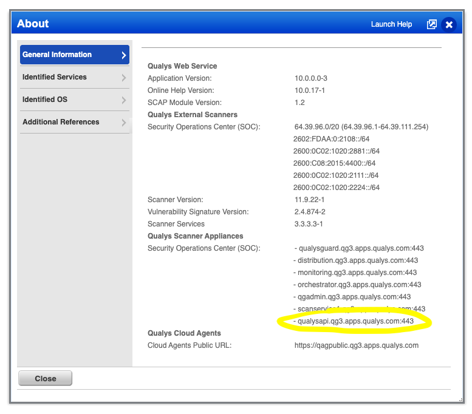

# Development

Add details here to give a brief overview of how to work with the provider APIs.
Please reference any SDKs or API docs used to help build the integration here.

## Prerequisites

Supply details about software or tooling (like maybe Docker or Terraform) that
is needed for development here.

Please supply references to documentation that details how to install those
dependencies here.

Tools like Node.js and NPM are already covered in the [README](../README.md) so
don't bother documenting that here.

## Provider account setup

Qualys offers a free trial via the following link:

<https://www.qualys.com/free-trial/>

After activating trial, you'll receive a username and instructions for resetting
password.

You can then find your API URL from the **Help** -> **About** link in the web
app.



## Authentication

All requests to the API use Basic Auth mechanism for sending username and
password. There is a _login_ API route that will send back a session ID but it
didn't seem neessary to use this endpoint and you would have to ensure that you
call _logout_ (otherwise you might hit maximum number of concurrent sessions
limit).

The Qualys API is a collection of APIs from different modules and the various
APIs follow different patterns.

The `QualysClient` class currently has the following methods:

- `qualysClient.assetManagement.listHostAssets(options)`
- `qualysClient.knowledgeBase.listQualysVulnerabilities(options)`
- `qualysClient.vulnerabilityManagement.listHostDetections(options)`
- `qualysClient.webApplicationScanning.listScans(options)`
- `qualysClient.webApplicationScanning.listWebApps(options)`
- `qualysClient.webApplicationScanning.fetchWebApp(options)`
- `qualysClient.webApplicationScanning.fetchScanResults(options)`

The _list_ functions return a _paginator_ that can be used similar to the
following:

```typescript
const paginator = qualysClient.assetManagement.listHostAssets(options);
do {
  const { responseData } = await paginator.next();
} while (paginator.hasNextPage());
```
